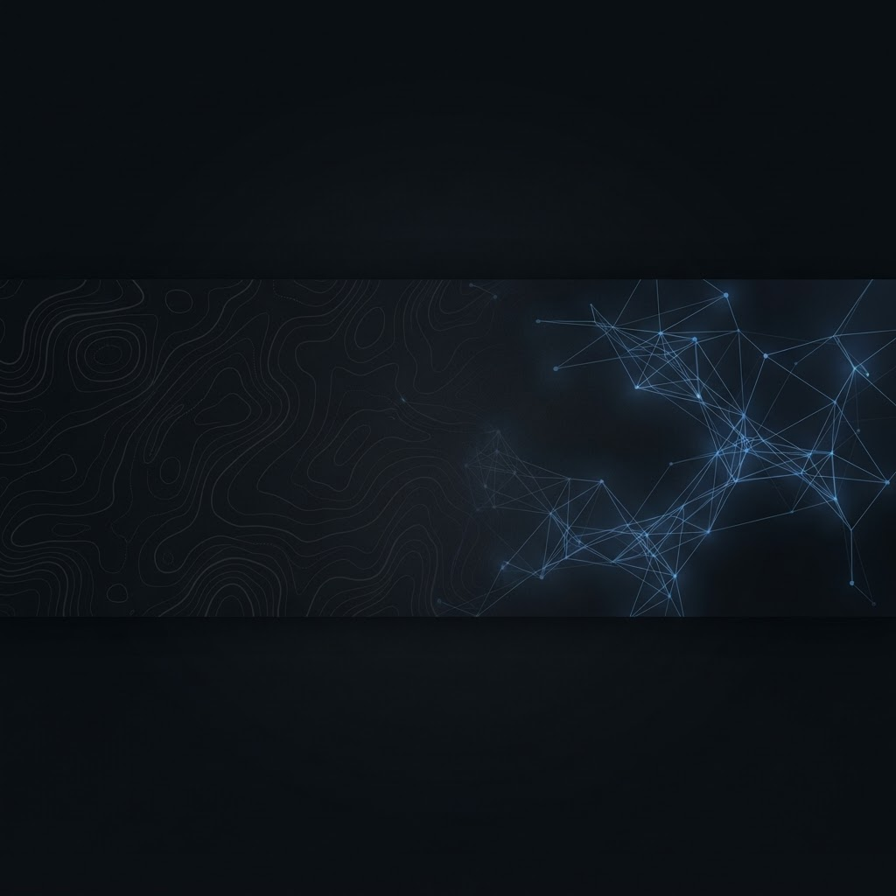
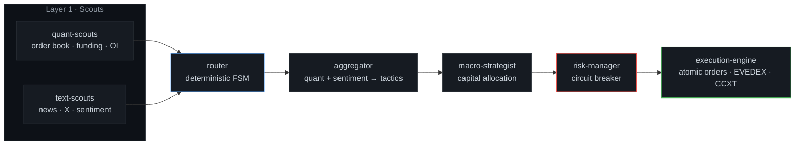

 

## Kairos — autonomous AI futures trader

Multi-layer trading system I architect and lead at [**Kairos-cryptoAI**](https://github.com/Kairos-cryptoAI). Deterministic where determinism matters, LLM reasoning where it pays off.

[kairos](https://github.com/Kairos-cryptoAI/kairos) · [quant-scouts](https://github.com/Kairos-cryptoAI/kairos-quant-scouts) · [text-scouts](https://github.com/Kairos-cryptoAI/kairos-text-scouts) · [router](https://github.com/Kairos-cryptoAI/kairos-router) · [aggregator](https://github.com/Kairos-cryptoAI/kairos-aggregator) · [macro-strategist](https://github.com/Kairos-cryptoAI/kairos-macro-strategist) · [risk-manager](https://github.com/Kairos-cryptoAI/kairos-risk-manager) · [execution-engine](https://github.com/Kairos-cryptoAI/kairos-execution-engine)

 

## PIMSR — physics-informed subsurface reconstruction

Neural inversion for geophysics. Benchmarked against production MT codes (Occam2DMT, ModEM) on real USArray data — **wins all 5 profiles**.

| Repository | What it does |
|:---|:---|
| [pimsr-inversion](https://github.com/TheLitis/pimsr-inversion) | Physics-informed neural inversion — multi-task property prediction with uncertainty |
| [pimsr-benchmarks](https://github.com/TheLitis/pimsr-benchmarks) | Benchmarks vs Occam2DMT & ModEM on real USArray data |
| [pimsr-forward](https://github.com/TheLitis/pimsr-forward) | MT + gravity forward modeling, sensor/noise simulation, dataset builder |
| [pimsr-geogen](https://github.com/TheLitis/pimsr-geogen) | Stochastic geology model generator |

 

## Stack

 

## Activity

  

 

## Contact

&nbsp;

